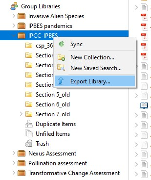

# Zotero

Zotero is, at the most basic level, a reference manager. It is designed to store, manage, and cite bibliographic references, such as books and articles. In Zotero, each of these references constitutes an item. More broadly, Zotero is a powerful tool for collecting and organizing research information and sources.

## Getting started

### How do I install Zotero

[https://www.zotero.org/support/quick\_start\_guide#how\_do\_i\_install\_zotero](https://www.zotero.org/support/quick\_start\_guide#how\_do\_i\_install\_zotero)

### How do I open Zotero

[https://www.zotero.org/support/quick\_start\_guide#how\_do\_i\_open\_zotero](https://www.zotero.org/support/quick\_start\_guide#how\_do\_i\_open\_zotero)

Zotero can be opened from your operating system's dock or file manager like any other program

### How do I join a group in Zotero

During the development of an assessment, private groups will be created at the assessment or chapter level depending on the needs of the assessment. Private groups means that only experts who are invited to the group will be able to see the group’s page. The private groups are completely hidden from group searches. They are not shown on members’ public profile pages and will not appear in search engine results. File sharing will be made available to allow group members to access and share files in addition to references. Invitations to the groups are managed by the assessment technical support unit.

## How to sync libraries


You need to be signed in on the Zotero client


Consider syncing only the libraries you use. This will minimise bandwidth requirements and improve the fludity of your work.

* Go to preferences
* Click on Sync
* Click on choose libraries
* In addition to setting your library sync preferences, you should also configure preferences for file syncing. It is recommended to set the downloads to "as needed" as shown in the image below.

<figure><figcaption>
Sync settings for libraries and files
</figcaption></figure>

## Adding tags multiple entries

You will need the Zotero Tag plug in for this ([https://github.com/windingwind/zotero-tag](https://github.com/windingwind/zotero-tag))&#x20;

### Install

* Download the latest release (.xpi file) from the [Releases Page](https://github.com/windingwind/zotero-tag/releases)\
  _Note_ If you're using Firefox as your browser, right click the xpi and select "Save As.."
* In Zotero click "Tools" in the top menu bar and then click "Addons"
* Go to the Extensions page and then click the gear icon in the top right.
* Select Install Add-on from file.
* Browse to where you downloaded the .xpi file and select it.
* Restart Zotero, by clicking "restart now" in the extensions list where the plugin is now listed.

### Usage

Once you have the plugin installed simply, right click any item in your collections to add/remove tags in batch.

## Adding bibliography to library

### Add item by identifier (recommended method)

Zotero can[ add items automatically](https://www.zotero.org/support/getting\_stuff\_into\_your\_library#add\_item\_by\_identifier) using their an ISBN number, Digital Object Identifier (DOI), or PubMed ID. This is done by clicking the Add Item by Identifier button () in the Zotero toolbar, typing in the ID number, and clicking OK. You can even paste or enter (press Shift+Enter for a larger box) a list of such identifiers at once

### Add item manually

Items can be[ added manually](https://www.zotero.org/support/getting\_stuff\_into\_your\_library#manually\_adding\_and\_editing\_items) by clicking the green New Item () button in the Zotero toolbar, then selecting the appropriate item type. Metadata can then be added by hand in the right-hand pane. Apart from the versatility this provides, it is important for adding primary documents.

## Citing

Zotero uses Citation Style Language (CSL) to properly format citations in many different bibliographic [styles](https://www.zotero.org/styles). IPBES has adopted the American Psychological Association 7th edition style. To use this style:&#x20;

1. In the[ Zotero Style Manager](https://www.zotero.org/support/preferences/cite), click on the American Psychological Association 7th edition. If it is not in the list of styles, click the 'Get additional styles' button, then find the “American Psychological Association 7th edition” style and click ok.&#x20;

## Moving Documents with Zotero Citations Between Word Processors

It is important to retain citation links in the final versions of documents.&#x20;

Authors have different preferences for their choice in word processors. Many experts prefer to use Google Docs because it facilitates online collaboration and it is easy to use. The drafts and and final documents are however, reviewed in MS Word so it is important to convert documents between different processors carefully to retain citation links.

If you use the Zotero word processor plugin to add citations to your document and then open the document in another word processor, the Zotero citation links will be lost. To retain active Zotero citations when moving between programs, you can use the plugin to convert the document to a temporary format that can be safely transferred and then restore it in another supported word processor.&#x20;

### Word to Google Docs

1. In Word, use File → Save As… to create a copy of the document as a .docx with a new filename (e.g., “My Document - Transfer.docx”).
2. Click Document Preferences in the Zotero plugin and select “Switch to a Different Word Processor…”.
3. After the document has been converted, save the changes (File → Save).
4. Use File → Open… from within a Google Doc to upload the file.
5. Select Refresh from the Zotero menu in the opened Google Doc to continue using the document.

### Google Docs to Word

1. In the Google Doc, use File → Make a Copy… to create a copy of the document.
2. In the new document, select “Switch word processors…” from the Zotero menu.
3. Select File → Download as → Microsoft Word (.docx) and save the converted file.
4. Open the downloaded file in Word and click Refresh in the Zotero plugin to continue using the document.

For more information please refer to [https://www.zotero.org/support/kb/moving\_documents\_between\_word\_processors](https://www.zotero.org/support/kb/moving\_documents\_between\_word\_processors)

## Reference workflow

1. The technical support units will be required to clean references stored in Zotero periodically. Experts will only have read only access when this is taking place
2. Experts are strongly encouraged to import references into Zotero using the Zotero web tool or by importing .ris and .bib files. Dragging of PDF files is discourgaged
3. File sharing through Zotero is possible. Preference should be on grey literature. DOI of other files will suffice.

## Archiving a library

To export an entire library, right-click on it in the Zotero collections pane and choose “Export Library…”, or select “Export Library…” from the “File” menu. To export an individual collection, right-click on it and choose “Export Collection…”. To export specific items, select them in the items list, right-click, and choose “Export Items…”.

When sharing items with another Zotero user, select Zotero RDF with files and notes for the most complete transfer.

<figure><figcaption>
Exporting an entire library
</figcaption></figure>

<figure><figcaption>
Select format (Zotero RDF) including notes, files and annotations
</figcaption></figure>

## Deleting multiple attachments

Deleting multiple attachments requires the creation of a "Saved Search". This can be used for deleting notes or PDFs or anything that meets a specified criteria.

1. Do an advanced search for "Attachment FIle Type --is --- PDF"&#x20;

<figure><figcaption>
Advanced search
</figcaption></figure>

2\. Create a saved search

<figure><figcaption>
Select "Attachment File Type" is "PDF" and then click on "Save Search"
</figcaption></figure>

3\. Navigate to the saved search and select all (ctrl+a or cmd+a on a mac) and the right-click on "move items to trash".&#x20;


The saved search will also contain the items to which the PDFs are attached, select all will only select the attachments.


<figure><figcaption>
Navigate to your Saved Search and select all attachments
</figcaption></figure>

## Workflow to clean and finalize libraries&#x20;

Please use this workflow when the assessment has been approved and there will be no further changes to the references included in the text.&#x20;

1. Archive the entire library before you start making any changes. Refer to instructions above on "[Archiving a library](zotero.md#archiving-a-library)"
2. In the Zotero chapter library, select one entry that was used in the chapter and create a tag named "assessment-chapterX". It is recommended to have a unique tag for each chapter. This will allow the determination of where and how frequent citations are used.
3. The bottom left of your screen shows all the tags in your library. Right click on the "assessment-chapterX" tag you just created. Click "Assign color". A pop up window will appear, ensure that the position is selected as 1 and press "Set Color". Assign a color for each of the chapter tags you created in #2.
4. Now, go to this website: [https://rintze.zelle.me/ref-extractor/](https://rintze.zelle.me/ref-extractor/). Select "Choose File" and navigate to the chapter file, and click open
5. Next, under the results section, press the "Select in Zotero button". Here you will see in which libraries the references are located. Select the chapter library which contains the references
6. Click "open Zotero" in the pop up window. Zotero should now open with all the citations used selected
7. Press 1 (or the number corresponding to the position of the tag as set in #3) . Now all used citations used in the chapter document are tagged
8. Simply go through all the entries not tagged and delete them from the library. You will be left with only the tagged references that were used in the document
9. Remove all tags created by automatically and by experts. you should start by deleting tags that were automatically created.

<figure><figcaption>
Delete Automatic Tags in This Library
</figcaption></figure>

Once you have finalized the clean up of the library you should change the library settings to limit modifications. The library "Group Type" should then be made public.

<figure><figcaption>
Library settings at the end of an assessment. Only group admins can add,edit or remove items or files
</figcaption></figure>

## Useful plugins

Zotero plugins:

* Search for DOI: [https://github.com/bwiernik/zotero-shortdoi](https://github.com/bwiernik/zotero-shortdoi)

Parse references from CSV: [https://anystyle.io/](https://anystyle.io/)

Search for DOI from citations: [https://doi.crossref.org/simpleTextQuery](https://doi.crossref.org/simpleTextQuery)

## Contact

Please contact the assessment technical support unit if you have questions regarding getting files into the assessment/chapter library, organizing the assessment/chapter Library and taking notes, generating bibliographies,citations, and reports.
