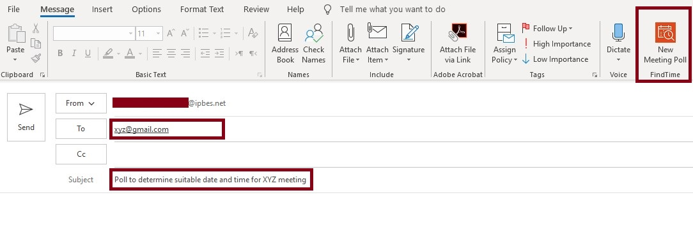
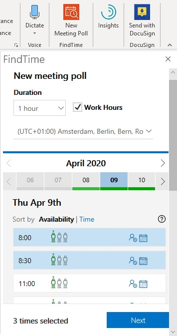
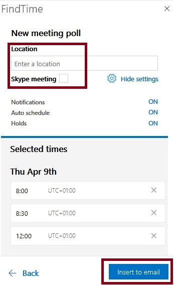
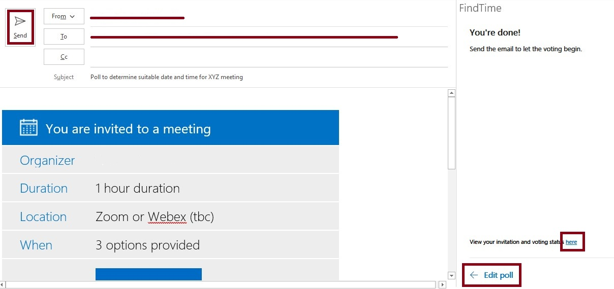

# Microsoft FindTime

## How to install

Step: 1 • Please visit [https://findtime.microsoft.com/](https://findtime.microsoft.com/) • Click on “Install for free” button

Step : 2 • Enter your email address and follow the prompts

Step: 3 • Restart your Outlook

## How to Use Microsoft FindTime

### Step 1:  

* Create a new email or select an email to reply to.
* List people required for the meeting in To and optional participants in Cc.

### Step 2  

* Click on New Meeting Poll icon
* Select meeting duration from the **Duration** drop down and check the Time Zone.
* Click on the meeting date and pick suitable time slots then click on **Next**


FindTime will check your calendar and will not suggest time slots if you have other scheduled meetings


### Step 3 

* Now enter meeting location or click on check-box for Skype Meeting link
* Click on Insert to email button

* You're done! Send the email to let the voting begin.

* You will be notified vie email once an attendee has voted 
* Once the voting has been completed, Microsoft FindTime will finalize the poll.
* You can [check the status of your polls](https://outlook.office.com/findtime/dashboard)  

