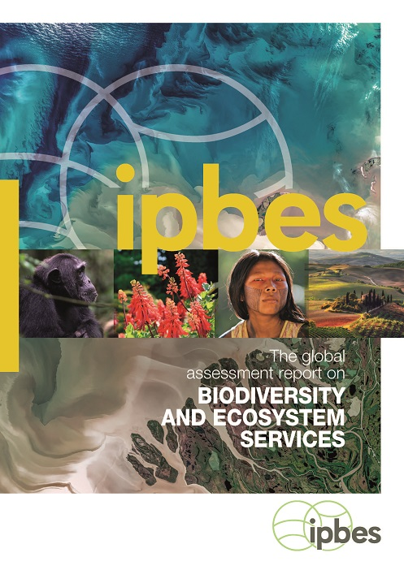

# First global assessment report on biodiversity and ecosystem services

**Prepared by Renske Gudde (TSU for data and knowledge management)**

**Reviewed by Aidin Niamir (TSU for data and knowledge management)**

_For any inquiries please contact_ [aidin.niamir@senckenberg.de](mailto:aidin.niamir@senckenberg.de)\
\
Version 1.0\
Last updated: 11 June 2024

DOI: [10.5281/zenodo.11611393](https://zenodo.org/doi/10.5281/zenodo.11611393)

This page is designed to help navigate through all the documents of the first global assessment, such as the SPM, individual chapters and the supplementary materials.

<figure><figcaption></figcaption></figure>

### Table of content 

* [Full report](first-global-assessment-report-on-biodiversity-and-ecosystem-services.md#full-report)
* [Summary for policymakers](first-global-assessment-report-on-biodiversity-and-ecosystem-services.md#summary-for-policymakers)
* [Chapter 1](first-global-assessment-report-on-biodiversity-and-ecosystem-services.md#chapter-1.-assessing-a-planet-in-transformation-rationale-and-approach-of-the-ipbes-global-assessmen)
* [Chapter 2.1](first-global-assessment-report-on-biodiversity-and-ecosystem-services.md#chapter-2.1.-status-and-trends-drivers-of-change)
* [Chapter 2.2](first-global-assessment-report-on-biodiversity-and-ecosystem-services.md#chapter-2.2.-status-and-trends-nature)
* [Chapter 2.3](first-global-assessment-report-on-biodiversity-and-ecosystem-services.md#chapter-2.3.-status-and-trends-natures-contributions-to-people-ncp)
* [Chapter 3](first-global-assessment-report-on-biodiversity-and-ecosystem-services.md#chapter-3.-assessing-progress-towards-meeting-major-international-objectives-related-to-nature-and-n)
* [Chapter 4](first-global-assessment-report-on-biodiversity-and-ecosystem-services.md#chapter-4-plausible-futures-of-nature-its-contributions-to-people-and-their-good-quality-of-life)
* [Chapter 5](first-global-assessment-report-on-biodiversity-and-ecosystem-services.md#chapter-5.-pathways-towards-a-sustainable-future)
* [Chapter 6](first-global-assessment-report-on-biodiversity-and-ecosystem-services.md#chapter-6.-options-for-decision-makers)
* [Glossary](first-global-assessment-report-on-biodiversity-and-ecosystem-services.md#glossary)
* [Underlying bibliographic data and research material](first-global-assessment-report-on-biodiversity-and-ecosystem-services.md#underlying-bibliographic-data-and-research-material)

#### **Full report**

* [Full report](https://doi.org/10.5281/zenodo.3831673)

#### **Summary for policymakers**

* [SPM](https://doi.org/10.5281/zenodo.3553458)
* Translations of the SPM in [Arabic](https://zenodo.org/doi/10.5281/zenodo.3826589), [Bengali](https://zenodo.org/doi/10.5281/zenodo.5727396), [Chinese](https://zenodo.org/doi/10.5281/zenodo.3826603), [Czech](https://zenodo.org/doi/10.5281/zenodo.4049924), [French](https://zenodo.org/doi/10.5281/zenodo.3826599), [German](https://zenodo.org/doi/10.5281/zenodo.5502689), [Japanese](https://zenodo.org/doi/10.5281/zenodo.3826698), [Russian](https://zenodo.org/doi/10.5281/zenodo.3826616), [Spanish](https://zenodo.org/doi/10.5281/zenodo.3826597), [Thai](https://zenodo.org/doi/10.5281/zenodo.4327515),  and [Vietnamese](https://zenodo.org/doi/10.5281/zenodo.4727603).

#### **Chapter 1. Assessing a planet in transformation: Rationale and approach of the IPBES Global Assessment on Biodiversity and Ecosystem Service**

* [Chapter 1](https://doi.org/10.5281/zenodo.3831852)
* [Supplementary materials for chapter 1](https://zenodo.org/doi/10.5281/zenodo.11577374)

#### **Chapter 2.1. Status and Trends – Drivers of Change**

* [Chapter 2.1](https://doi.org/10.5281/zenodo.3831881)
* [Supplementary materials for chapter 2.1](https://zenodo.org/doi/10.5281/zenodo.11577965)

#### **Chapter 2.2. Status and Trends – Nature**

* [Chapter 2.2](https://doi.org/10.5281/zenodo.3832005)
* [Supplementary materials for chapter 2.2](https://doi.org/10.5281/zenodo.11578604)

#### **Chapter 2.3. Status and Trends – Nature’s Contributions to People (NCP)**

* [Chapter 2.3](https://doi.org/10.5281/zenodo.3832035)
* [Supplementary materials for chapter 2.3](https://zenodo.org/doi/10.5281/zenodo.11579133)

#### **Chapter 3. Assessing progress towards meeting major international objectives related to nature and nature's contributions to people**

* [Chapter 3](https://doi.org/10.5281/zenodo.3832052)
* [Supplementary materials for chapter 3](https://zenodo.org/doi/10.5281/zenodo.11579456)

#### **Chapter 4: Plausible futures of nature, its contributions to people and their good quality of life**

* [Chapter 4](https://doi.org/10.5281/zenodo.3832073)
* [Supplementary material for chapter 4](https://zenodo.org/doi/10.5281/zenodo.11580409)

#### **Chapter 5. Pathways towards a Sustainable Future**

* [Chapter 5](https://doi.org/10.5281/zenodo.3832099)
* [Supplementary material for chapter 5](https://zenodo.org/doi/10.5281/zenodo.11580477)

#### **Chapter 6. Options for Decision Makers**

* [Chapter 6](https://doi.org/10.5281/zenodo.3832107)
* [Supplementary material for chapter 6](https://zenodo.org/doi/10.5281/zenodo.11580588)

#### Glossary

* [GA1 glossary](https://zenodo.org/doi/10.5281/zenodo.5020598)

#### Underlying bibliographic data and research material

* [GA1 Zotero library](https://www.zotero.org/groups/2333077/ipbes\_ga1)
