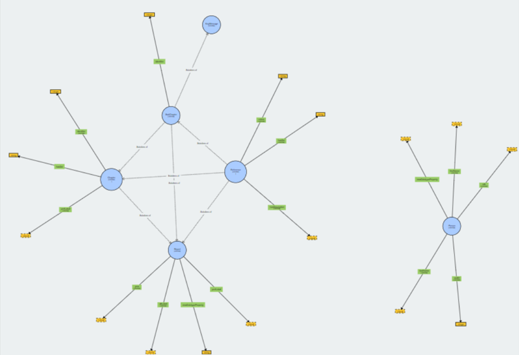

# IPBES Ontology

### The IPBES Ontology

**Prepared by Maral Dadvar - resource person for the IPBES task force on data and knowledge management**

**Reviewed by Aidin Niamir - Head of the Technical Support Unit for data and knowledge management**

_For any inquires please contact_ [_aidin.niamir@senckenberg.de_](mailto:aidin.niamir@senckenberg.de)

Version: 1.0\
Last Updated: December 19th, 2023

DOI: [10.5281/zenodo.10404414](https://doi.org/10.5281/zenodo.10404414)

### Abstract

The ontology developed for representing intergovernmental reports and the broad topics and information that they cover.

### Table of content

1. [Introduction](ipbes-ontology.md#1.-introduction)
2. [Namespace Declarations](ipbes-ontology.md#2.-namespace-declarations)
3. [The IPBES Ontology Visualisation](ipbes-ontology.md#3.-the-ipbes-ontology-visualisation)
4. [The IPBES Ontology Description](ipbes-ontology.md#4.-the-ipbes-ontology-description)
5. [Classes and Attributes](ipbes-ontology.md#5.-classes-and-attributes)
6. [References](ipbes-ontology.md#6.-references)

### 1. Introduction

The Intergovernmental Science-Policy Platform on Biodiversity and Ecosystem Services (IPBES) is the intergovernmental body which assesses the state of biodiversity and of the ecosystem services it provides to society, in response to requests from decision makers. To this end, it produces regular regional, national and global assessment reports in collaborations with many experts, scientists and politicians from a wide range of expertise, nationalities and backgrounds. To our knowledge, there is no existing ontology for representation of intergovernmental reports and the broad topics and information that they cover. To this end, we have created the IPBES ontology as the stepping stone for representing these types of data as LOD and make them accessible for further exploration.

### 2. Namespace Declarations

This is the list of the namesspaces used in this ontology.

| Namespace prefix | Namespace URI                                                               |
| ---------------- | --------------------------------------------------------------------------- |
| ipbes            | [https://ontology.ipbes.net/report](https://ontology.ipbes.net/report)      |
| foaf             | [http://xmlns.com/foaf/0.1/](http://xmlns.com/foaf/0.1/)                    |
| skos             | [http://www.w3.org/2004/02/skos/core#](http://www.w3.org/2004/02/skos/core) |

### 3. The IPBES Ontology Visualisation

<figure><figcaption>
Figure visualising the IPBES ontology
</figcaption></figure>

### 4. The IPBES Ontology Description

The classes and properties used in IPBES ontology are created on the fly based on the information that we encounter and the concepts that we aimed to represent. However, the usage of the properties consistent and the coined URI’s are stable and unique. Currently our ontology consists of 6 classes, each representing a specific part of the data along with their corresponding properties.

### 5. Classes and Attributes

| Classes                            |                                      |                                            |                                             |                                          |                                    |
| ---------------------------------- | ------------------------------------ | ------------------------------------------ | ------------------------------------------- | ---------------------------------------- | ---------------------------------- |
| [Report](ipbes-ontology.md#report) | [Chapter](ipbes-ontology.md#chapter) | [Subchapter](ipbes-ontology.md#subchapter) | [KeyMessage](ipbes-ontology.md#key-message) | [Reference](ipbes-ontology.md#reference) | [Person](ipbes-ontology.md#person) |

#### **Report**

| Class          |                                                                      |
| -------------- | -------------------------------------------------------------------- |
| _ipbes.Report_ | [http://ontology.ipbes.net/report](http://ontology.ipbes.net/report) |

<table><thead><tr><th width="452">Properties</th><th></th></tr></thead><tbody><tr><td><em>skos:prefLabel</em></td><td>The label that is preferred to be used for a chapter, sub-chapter , report or person</td></tr><tr><td><em>Skos:altLabel</em></td><td>Alternative writing format or language of the preferred label</td></tr><tr><td><em>ipbes:year</em></td><td>The publication year</td></tr><tr><td><em>ipbes:hasDoi</em></td><td>The DOI number</td></tr></tbody></table>

#### **Chapter**

| Class           |                                                                              |
| --------------- | ---------------------------------------------------------------------------- |
| _ipbes.Chapter_ | [http://ontology.ipbes.net/report/ch/](http://ontology.ipbes.net/report/ch/) |

| Properties         |                                                                                      |
| ------------------ | ------------------------------------------------------------------------------------ |
| _skos:prefLabel_   | The label that is preferred to be used for a chapter, sub-chapter , report or person |
| _ipbes:Report_     | Link to the class Report of the chapter                                              |
| _ipbes:hasDoi_     | The DOI number                                                                       |
| _ipbes:identifier_ | The identifier of the chapter or sub-chapter or key message in the report            |
| _foaf.Person_      | The list of persons who have a role in this chapter                                  |

#### **Subchapter**

| Class              |                                                                                |
| ------------------ | ------------------------------------------------------------------------------ |
| _ipbes.SubChapter_ | [http://ontology.ipbes.net/report/sch/](http://ontology.ipbes.net/report/sch/) |

| Properties             |                                                                                      |
| ---------------------- | ------------------------------------------------------------------------------------ |
| _ipbes:identifier_     | The identifier of the chapter or sub-chapter or key message in the report            |
| _ipbes:Chapter_        | Link to the class Chapter of the sub-chapter                                         |
| _ipbes:Report_         | Link to the class Report of the sub-chapter                                          |
| _ipbes:KeyMessage_     | Link to the class KeyMessage for which the sub-chapter has been referred to          |
| _ipbes:reference_      | Link to the class reference for the citations used in each subchapter                |
| _skos:prefLabel_       | The label that is preferred to be used for a chapter, sub-chapter , report or person |
| _ipbes:hasDescription_ | The text that further describes the content                                          |

#### **Key message**

| Class              |                                                                                |
| ------------------ | ------------------------------------------------------------------------------ |
| _ipbes.KeyMessage_ | [http://ontology.ipbes.net/report/key/](http://ontology.ipbes.net/report/key/) |

| Properties                       |                                                                                     |
| -------------------------------- | ----------------------------------------------------------------------------------- |
| _ipbes:SubChapter_               | Link to the class SubChapter in which the key message has been referred to          |
| _ipbes:identifier_               | The identifier of the chapter or sub-chapter or key message in the report           |
| _ipbes:Report_                   | Link to the class Report of the key message                                         |
| _skos:prefLabel_                 | The label that is preferred to be used for a chapter, sub-chapter, report or person |
| _ipbes:hasDescription_           | The text that further describes the content                                         |
| _ipbes:hasEstablishedIncomplete_ | Level of confidence                                                                 |
| _ipbes:hasWellestablished_       | Level of confidence                                                                 |
| _ipbes:hasUnresolved_            | Level of confidence                                                                 |
| _ipbes:hasInconclusive_          | Level of confidence                                                                 |

#### **Reference**

| Class             |                                                                                |
| ----------------- | ------------------------------------------------------------------------------ |
| _ipbes.Reference_ | [http://ontology.ipbes.net/report/ref/](http://ontology.ipbes.net/report/ref/) |

| Properties             |                                                                   |
| ---------------------- | ----------------------------------------------------------------- |
| _ipbes:Chapter_        | Link to the class Chapter in which the reference has been used    |
| _ipbes:Report_         | Link to the class Report                                          |
| _ipbes:SubChapter_     | Link to the class SubChapter in which the reference has been used |
| _ipbes:zotero_         | Link to the zotero repository of the reference                    |
| _ipbes:hasDescription_ | The text that further describes the content                       |
| _ipbes:hasDoi_         | The DOI number                                                    |

#### **Person**

| Class         |                                                                                      |
| ------------- | ------------------------------------------------------------------------------------ |
| _foaf.Person_ | [http://ontology.ipbes.net/report/person/](http://ontology.ipbes.net/report/person/) |

<table><thead><tr><th width="248">Properties</th><th></th></tr></thead><tbody><tr><td><em>foaf:firstName</em></td><td>First name of the person</td></tr><tr><td><em>foaf:lastName</em></td><td>Family name of the person</td></tr><tr><td><em>skos:prefLabel</em></td><td>The label that is preferred to be used for a chapter, sub-chapter, report or person</td></tr><tr><td><em>ipbes:orcID</em></td><td>ORCID identifier of the person</td></tr><tr><td><em>ipbes:country</em></td><td>Country of residence of the person</td></tr><tr><td><em>ipbes:ca</em></td><td>Contributing authors in the stated chapter and report</td></tr><tr><td><em>ipbes:cl</em></td><td>Coordinating lead authors in the stated chapter and report</td></tr><tr><td><em>ipbes:fl</em></td><td>Fellows in the stated chapter and report</td></tr><tr><td><em>ipbes:cs</em></td><td>Co-chairs in the stated chapter and report</td></tr><tr><td><em>ipbes:la</em></td><td>Lead authors in the stated chapter and report</td></tr><tr><td><em>ipbes:re</em></td><td>Review editors in the stated chapter and report</td></tr></tbody></table>

### 6. References

https://www.w3.org/2009/08/skos-reference/skos.html

http://xmlns.com/foaf/0.1/
