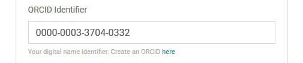
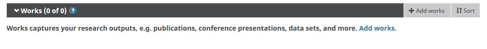
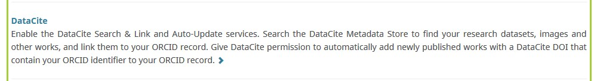
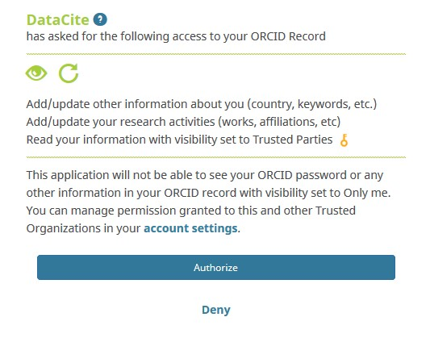

# ORCID

## ORCID

[About ORCID](https://orcid.org/about/what-is-orcid/mission)

## Why do you need an ORCID

1. An ORCID iD reliably connects you with your works, awards, and affiliations. 
2. ORCID alleviates mistaken identity. Many researchers share the same, or a similar name, making it easy to confuse you with someone else. This is even more likely to be the case if you have changed your name, use different versions of your name, or have a name that has been transliterated into other languages. 
3. You own and control your record, managing what information is connected and how it is shared. ORCID’s visibility settings are very granular, so you can make different data elements visible to different groups.
4. More and more of the systems you already use are connected with ORCID. With over 700 members and more than 500 live integrations, ORCID is already being used in many of your existing workflows. 
5. ORCID improves recognition for you and your research. Using your iD creates reliable connections between your iD and your research activities. 
6. ORCID increases discoverability of your research outputs. 

## How to register

[Click here to register](https://orcid.org/register)

## Inform secretariat of your ORCID

The secretariat requires ORCID identifiers to link authors to IPBES products they contribute to. The best way to provide this information is by updating your website user profiles. See documentation on how to update your profile [here](https://docs.ipbes.net/account/account#view-and-update-profile).

## Link your work

ORCID allows you to sync your publications from various indexing platforms.

* Airiti
* BASE - Bielefeld Academic Search Engine
* Crossref Metadata Search
* DataCite
* Deutsche Nationalbibliothek \(DNB\)
* Europe PubMed Central
* ISNI
* JaLC
* KoreaMed
* MLA International Bibliography
* Redalyc
* Research Data Australia
* Scopus - Elsevier

IPBES uses Zenodo which indexes data in DataCite. Please follow the following steps to link your publications to your ORCID profile.

