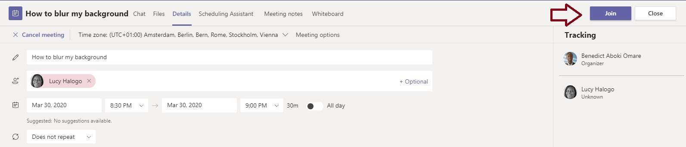
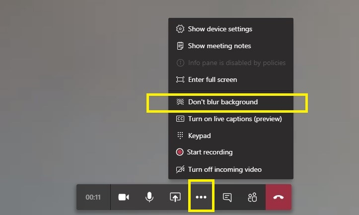

# MS Teams meetings and calls


**Note:** To avoid frustrations use MS Teams for meetings and calls within the secretariat \(users with @ipbes.net or @un.org accounts\). It is recommended to use Zoom or GoTo Meeting for external meetings.


## Introduction

Cloud-based meeting recording, support for larger meetings of up to 250 participants; **teams** meetings, which provides the ability to host meetings across multiple organisations. Meetings in Teams include audio, video, and sharing.

## Meet Now

You can launch an instant meeting with a colleague using the Meet Now service of MS Teams. You can start a Meet Now as follows meeting, do one of the following:

1. Click on the Meet Now icon from a channel or conversation.

1. In your video preview, enter a name for the meeting, and select Meet Now
2. Select the names of the team members you want to invite to the meeting. You can also type a phone number, a good way to add people outside your organization that aren't using Teams.


You can watch these instructions in this [Video Tutorial](https://www.microsoft.com/en-us/videoplayer/embed/RWedV7?pid=ocpVideo0-innerdiv-oneplayer&postJsllMsg=true&maskLevel=20&market=en-us)


## Schedule a meeting

### Schedule a meeting from MS Teams

Meetings can either be set up through the Microsoft Teams App or Outlook. There are several ways to schedule a meeting:

1. Select **Schedule a meeting** in a chat \(this is below the compose box\) to book a meeting with the people in the chat.
2. Go to **Calendar** on the left side of the app and either select **New meeting** at the top right of the app, or select a range of time in your calendar and it will pop open a scheduling form.

Similar to Outlook, in the scheduling form is where you'll give a title to your meeting, invite people, and add meetings details.

On the right side of the scheduling form you will have the option to add a channel, individual people, or leave both blank to book yourself an appointment.

### Schedule a meeting from your calendar

1. Open Outlook and switch to the calendar view. Click **New Teams Meeting** at the top of the view
2. Add your invitees to the **To** field—you can even invite entire contact groups \(formerly known as distribution lists\). Add your meeting subject, location, start time, and end time. Then click **Send**.
3. You can also invite people from outside your organization from Outlook. Just be sure to [add them as guests](https://support.office.com/en-us/article/add-guests-to-a-team-in-teams-fccb4fa6-f864-4508-bdde-256e7384a14f) before the meeting starts or they will have to join anonymously.

[ Find out more](https://support.office.com/en-us/article/schedule-a-teams-meeting-from-outlook-883cc15c-580f-441a-92ea-0992c00a9b0f#ID0EAABAAA=iOS)

## Set up Virtual Breakout Rooms

## Join a MS Teams meeting

You can join Teams meetings anytime, anywhere, from any device.

### Join by link

All you need to join a Teams meeting is a link.

When you open the link or select **Join Microsoft Teams Meeting** in your meeting invite, you’ll be directed to a page where you can choose to either join on the web or download the desktop app and then join. If you already have the Teams app, the meeting will open there automatically.

If you don’t have a Teams account and the organizer has allowed it, you may have the option to enter your name to join the meeting as a guest. If you do have a Teams account, select **Sign in** to join with access to the meeting chat and more. Then, depending on the organizer’s settings, you may join the meeting right away or go to the lobby where people in the meeting can admit you.

### Join by phone

Even if you don’t have internet access or the Teams app, you can join some meetings by phone. If it has a phone number and conference ID in the meeting invite, just dial to join.

If you see a phone number in your invitation, but it’s not local to you, select **Local numbers** and find one that works for you.

### Join from calendar

Select **Calendar**  on the left side of the app to see your meetings. Find the meeting you want, and then select **Join**.

Or, if someone starts the meeting, you'll get a notification you can use to join.

### Join in a channel

If a meeting takes place in a channel, you’ll see an invitation to join, relevant content, and who’s in the meeting right in the channel. Just select **Join**.

### Join from chat

If the meeting has already begun, it appears in your recent chat list. Select the meeting in your chat list and then select **Join** at the top of the chat.

### Join a meeting without a Teams account

You can join a Teams meeting anytime, from any device, whether or not you have a Teams account. If you don't have an account, follow these steps to join as a guest.


**Note:** Some meetings don't allow people to join as guests.


Go to the meeting invite and select **Join Microsoft Teams Meeting**.

1. That'll open a webpage, where you'll see two choices: **Download the Windows app** and **Join on the web instead**. If you join on the web, you can use either Microsoft Edge or Google Chrome. Your browser may ask if it's OK for Teams to use your mic and camera. Be sure to allow it so you'll be seen and heard in your meeting.
2. Enter your name and choose your audio and video settings. If the meeting room \(or another device that's connected to the meeting\) is nearby, choose **Audio off** to avoid disrupting. Select **Phone audio** if you want to listen to the meeting on your mobile phone.
3. When you're ready, hit **Join now**.
4. This will bring you into the lobby. We'll notify the meeting organizer that you're there, and someone in the meeting can then admit you.

## Invite people to a meeting in Teams

### Before a meeting

To invite someone to join a meeting, use the **Invite people** box to search for and invite people when you schedule or edit a meeting. Then, you can use the scheduling assistant to see times when everyone is free.

### In a meeting

1. When you're in a meeting, select **Show participants**  in your meeting controls to see the people who were invited but haven't joined yet.
2. To ask someone who was invited to join the meeting, select their name &gt; **More options** &gt; **Ask to join** . You can also type a person's name or phone number in the search box to add someone who was not previously invited.

## **Share Screen**

1. Select **Share**  in your meeting controls. Then, choose to present your entire desktop, a window, a PowerPoint file, or a whiteboard.

When you're done sharing, go to your meeting controls and select **Stop sharing**.


**Note:** If you're using a Mac, you'll be prompted to change your privacy settings before you're able to share your screen. Also, window sharing isn't available for Linux users.


#### Include system audio

Sharing your system audio lets you stream your computer audio to meeting participants through Teams. You can use it to play a video or audio clip as part of a presentation.

1. Select Share  in your meeting controls and then **Include system audio**. When you share, all your system audio, including notifications, will be included in the meeting. For more on sharing system audio, check out [Share system audio in a Teams meeting](https://support.office.com/en-gb/article/share-system-audio-in-a-teams-meeting-dddede9f-e3d0-4330-873a-fa061a0d8e3b).

## Raise your hand during a meeting

During a meeting, you can raise a virtual hand to let people know you want to contribute without interrupting the conversation.


This feature is not available in one-on-one calls.


1. During an ongoing meeting, just select **Raise your hand option** in the meeting controls.

All meeting participants in the meeting will see that you've got your hand up. 

The meeting presenters will receive a notification that your hand is raised, and they can lower your hand once you've had a chance to talk. 

Select **Show participants**   to see a list of everyone in attendance. Anyone who's raised their hand will have an icon next to their name. When multiple people raise their hands, they'll be listed in the order in which they raised them. 

## **Take notes during a meeting**

Meeting notes are a great place to capture and share notes before, during, and after a Teams meeting. 

### During the meeting

1.  Go to **More options**  &gt; **Show meeting notes**  in the meeting controls section. If you have not taken any notes yet, select **Start taking meeting notes**.
2.  Otherwise, start typing your notes. Use the controls at the top of the panel to format and lay out the text. To add a new note, select **Add a new section here.** Use @mentions to draw someone's attention to a specific note or assign an action item.


When you first add a note, a notification will be sent on your behalf in the meeting chat. 

In a recurring meeting, the notes persist from meeting to meeting. Each meeting becomes a new section in the notes.


### After a meeting

To access notes from a channel meeting, go to the channel where the meeting occurred and find the meeting. Beneath it, select **Show notes in fullscreen**.

The meeting notes open in a Wiki tab that you can read or add to. [Edit and format the tab](https://support.microsoft.com/en-us/office/edit-and-format-a-wiki-tab-in-teams-cf83edd1-6bdb-4c0e-8040-bd70b3a11222) just like you would any other Wiki tab.

## Blur your background in a Teams meeting

If you want to avoid embarrassing moments during video calls, don't forget to blur your background or replace it entirely.

1.Press the **Join** button

* Enable video, toggle the middle slider option to activate background blur and then click on **Join now**.

To blur the video after joining the meeting:

1. Click the **…** dots button to open a menu as in the snapshot directly below
2. Click the **Blur my background** option.
3. You can remove the blurred background effect by clicking the **…** button and selecting the **Don’t blur background** option.

## Set a custom background image

You can create your own images, upload them to Teams, and then select them as a background image for your video chats. To do so: 

1. Copy the the following link and paste in the bottom left search option on your windows computer: %APPDATA%\Microsoft\Teams\Backgrounds\**Uploads**

2. Upload the image\(s\) you want to use to the uploads folder:


Images resolution should be **1920×1080.** Only .**JPG and .PNG** image files are allowed. 


3. On your Teams app, at the bottom of the screen, click or tap the three dots to go to your **Meeting controls**.

4.  Select **More actions** &gt; **Show background effects**. Select your background, or choose from the available images to replace it. 


Note that the update background is per meeting only. You will need to update a new background for each meeting.


