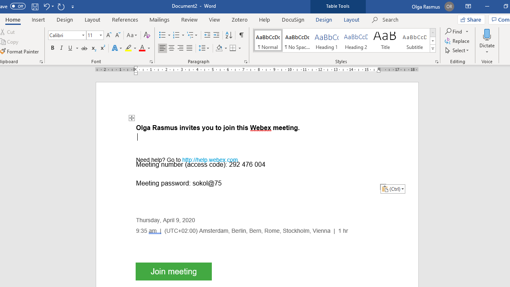
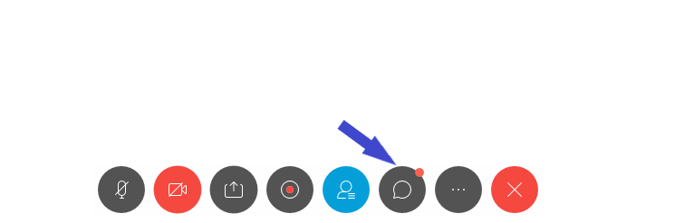
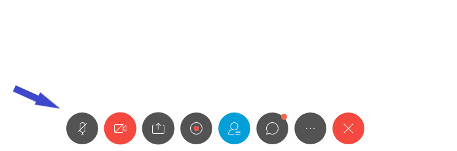
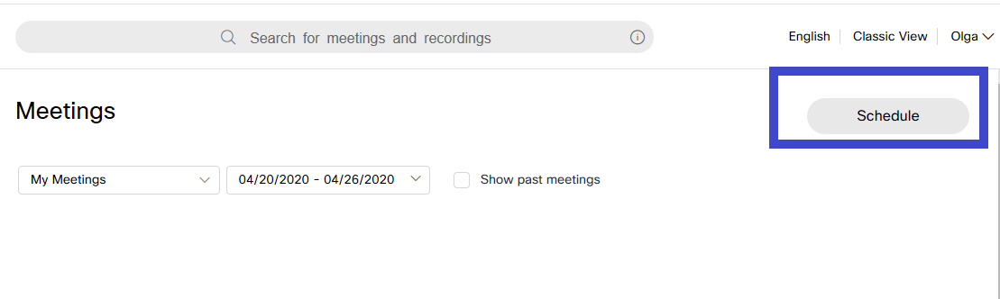

# Webex

## Introduction

Webex is a software solution for video conferencing, online meetings and webinars. 


Prerequisites:

1. Computer/laptop with Internet access or telephone.
2.  Webex meeting center conveniently works inside your **web browser** with no programme to download, install or configure.
3. You can also join the meeting from the **desktop app** or the **mobile app** if it is more convenient to you. More detailed information on this can be found [here](https://help.webex.com/en-us/ozygebb/Join-a-Cisco-Webex-Meeting)  


## Webex test call

You can [join a test meeting](https://www.webex.com/test-meeting.html/) to familiarize yourself with Webex. 

## Join a Webex Meeting from an Email Invitation 

* You will be sent an email with meeting information such as: meeting number \(access code\), date, time, and who initiated the meeting. If the meeting has a required password, it will be included in this mail;
* Click &lt;**Join meeting**&gt; in the body of the email.


1. You can join the meeting in different ways, like from your computer, mobile device, phone or video system. Your invite includes the options available to you for that particular meeting.   
2. If you choose to join the conference using a phone, you will need to call into the meeting. Dial the number provided in the mail and then use the access code and Attendee ID to connect when prompted.
3. If you choose to use your computer for audio, click &lt;**Call using computer&gt;**. You will have the opportunity to test your microphone and headset/speakers before connecting to the conference.


## Navigating Webex

When you are connected, you will see the following window. Some of the controls and options are available only to the presenter. 

### **Private chat with the host or presenter**

1. Under the Chat Window, click the drop-down box. Here you can select who can view your message;

2. Click on the name of the person you would like to privately chat with;

3. Type your message and press send.


Private chats are displayed in the same box as public chats, but only those involved with the private chat will see your message. 


### Raising your hand

You can raise your hand by first clicking on &lt;Participants&gt; button at the bottom of the window and then on a small hand icon next to your name in the participants list.  

### Enabling or disabling video

You can disable/enable video by clicking on the video icon

### Mute or unmute microphone

You can mute or unmute you by clicking on microphone icon

### Sharing content

You can also share the content by clicking on the following icon

## Tips for managers/hosts

### Scheduling the meeting

Sign in here  [https://unep.webex.com](https://unep.webex.com) using your unite identity account

If you want to schedule a meeting, please select **Meetings** in the menu on the left side 

After going to **Meetings** click on **Schedule** on the right side

Complete all the necessary fields and click on **Schedule** at the bottom of the form. You will receive an email confirmation by email.

### Breakout sessions

Breakout sessions can be used to place your attendees into smaller groups. Detailed information on how to create sessions, assign attendees to them, etc. can be found [here](https://help.webex.com/en-us/8cckd2/Manage-Breakout-Sessions-in-Cisco-Webex-Training).

* If you create breakout sessions automatically, attendees will be assigned randomly. You need to create session's manually and identify presenters and participants for each breakout sessions.
* At any time during a session you can specify that attendees can start breakout sessions with all **attendees/participants**, **only the session host, only the presenter** or **any other attendee privately.** You can remove breakout session privileges at any time.
* There are _four breakout session privileges_ that can be granted to all attendees: **host**, **presenter**, **panelists**, **all attendees**.
* The host or the presenter always have all breakout session privileges, regardless of the breakout session privileges that other attendees have. 

### Polls

Polling option can be used to create and share questionnaires. More detailed information can be found [here](https://help.webex.com/en-us/n0pdj9x/Start-a-Poll-in-Cisco-Webex-Meetings)


1. You can start the meeting either from the email you have received or signing in your Webex account and selecting the scheduled meeting under **Meetings**.
2. When scheduling a meeting you can also save it as template.
3. You can make notes during the meeting selecting **Notes** under **More Options** icon.
4. The order in which the attendees click on the Raise hand icon appears when you are a presenter.
5. Best practices for communicating with participants: using polls, sharing content, files, applications, how to open a new whiteboard, use the Q&A panel, etc.  can be found [here. ](https://help.webex.com/en-us/n1i89j0/Best-Practices-for-Communicating-with-Participants-in-Cisco-Webex-Training)


