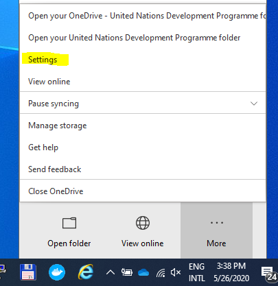

# ZOOM

## Introduction

ZOOM is a video conferencing tool used for meetings and webinars. Meetings and webinars can be attended via phone and computer. Meeting participants will receive an event invitation via email.

If you have any question\(s\) or need any help, email us at: ipbes.registration@ipbes.net


[Latest ZOOM video Tutorials](https://support.zoom.us/hc/en-us/articles/206618765-Zoom-Video-Tutorials)



**Prerequisites:**

1. Stable internet connection
2. A desktop computer, a laptop, or a mobile device \(either Android or iOS\)
3. A web camera \(optional\)
4. A headset with a microphone: A headset with a microphone allows you to hear and be heard more clearly.
5. ZOOM desktop client which can be downloaded from: [https://zoom.us/download](https://zoom.us/download) \(and select “ZOOM Client for Meetings”\). **Note that ZOOM Client is needed to listen to Interpretation**. You can still join with the browser but only the “floor” languages will be available
6. The URL of the meeting or the meeting ID. If you are joining via telephone, you will need the [teleconferencing number](http://zoom.us/zoomconference) provided in the invite.


## Before joining a ZOOM meeting

### D**ownload and install ZOOM app**

 **I**f you haven’t used ZOOM before click [here ](https://zoom.us/download)to **download ZOOM prior to the day of the meeting** and familiarize yourself with some of the features you may need to use, i.e. sharing screen, mute/unmute microphone, stop/start video etc.

#### ZOOM Client

* Go to ZOOM download center [https://zoom.us/download](https://zoom.us/download), then click on the **Download** button under “ZOOM Client For Meetings”.
  * This application will automatically download when you join your first ZOOM Meeting.
* Download and install the ZOOM application onto your computer.

#### ZOOM Mobile app

* Go to ZOOM download center [https://zoom.us/download](https://zoom.us/download)  then click on the **Download** button under “ZOOM Mobile Apps”. Or, on your mobile device, navigate to the app store compatible with your device: [Google Play store](https://play.google.com/store/apps/details?id=us.zoom.videomeetings) for Android users or [Apple's App Store](https://itunes.apple.com/us/app/id546505307) for iOS users.
* Download and install
* Once the download has completed, open the app. You will be prompted to sign in. 
* Enter login credentials and click on Sign in button .

### Update ZOOM Client

* ZOOM [regularly provides new versions](https://support.zoom.us/hc/en-us/articles/360042414611) of the ZOOM desktop client and mobile app to release new features and fix bugs. **We recommend upgrading to the latest version once it is available.** You can also [check which version you're currently running.](https://support.zoom.us/hc/en-us/articles/201362393) 
* Follow the instructions below to update your ZOOM client.

### Test call

Please ensure your headphone, microphone and video \(optional\) is working. You can run a test at [https://zoom.us/test](https://zoom.us/test)\*\*\*\*

### **Join early** 

Please join the meeting at least 15 minutes before the meeting start time if possible to leave time for troubleshooting any unforeseen issues that might arise. 

## Scheduling a ZOOM meeting

There are many ways to [schedule a meeting](https://support.zoom.us/hc/en-us/articles/201362413), including the ZOOM web portal, through the Zoom client, or with one of our [extensions or plugins](https://support.zoom.us/hc/en-us/sections/201728973). Here are some basic instructions for scheduling your first meeting. 

1. Sign in to your ZOOM web portal.
2. Click **Meetings**.
3. Click **Schedule a Meeting**.
4. Choose the date and time for your meeting. 
5. \(Meeting Options\) Select any [other settings](https://support.zoom.us/hc/en-us/articles/201362413) you would like to use. For example:
   *  **Allow participants to** [**join before start time**](https://support.zoom.us/hc/en-us/articles/202828525): This option permits participants to join the meeting without you or before you join. The _'Allow participants to join anytime'_ can be found under _Meeting Options._
6. Click **Save**.

## Joining a ZOOM meeting

Participants can join a meeting by clicking the provided **meeting link** or by going to [join.zoom.us](https://zoom.us/join) and entering the **meeting ID** provided in the invitation email.

1. Click on the ZOOM link \(it will look something like this: [https://ipbes.zoom.us/j/123456789](https://ipbes.zoom.us/j/123456789)\) OR
2. Go to [https://ipbes.zoom.us/join](https://ipbes.zoom.us/join) and Enter the Meeting ID that you have been provided with in the appropriate field and click ‘Join’ \(the Meeting ID will be a 9 or 10 digit number\)

### Join from a mobile Device

If you are joining from a mobile device you will be prompted to download the ZOOM Cloud Meetings app from the applications store. See [here](https://support.zoom.us/hc/en-us/sections/200305413-Mobile) for more platform specific details.

1. Open the app and login with your credentials.
2. Choose **Join a Meeting**.
3. Enter the “Meeting ID.”

### Join from ZOOM desktop client

When entering a ZOOM meeting for the first time from a computer you will need to download a small application file. This process is easy to complete on all commonly used browsers. See examples below:

**Mozilla Firefox**

Click ‘Save File’ and follow the instruction in the orange box.

**Google Chrome**

Google Chrome should automatically download the file and point to it as shown above. Clicking on the Zoom\_launcher.exe file will install ZOOM, there will be a short pause before a blue progress bar appears indicating the installation.

If an ‘Application Launcher’ or ‘External Protocol Request’ box appears simply tick the ‘_Remember my choice…_’ option box and then click ‘OK’

 

Just before entering the meeting you will be prompted to enter a display name. This name is simply to identify you in the meeting.Please enter both your given and family names.

#### Joining from a computer: audio settings

You will then be prompted how you wish to join your audio. If you wish to join audio via the telephone, follow the instructions further down, otherwise simply select Join Computer by Audio _\(TIP: by ticking the “Automatically join audio by computer…” option box first, will mean you won’t get prompted again in the future\)_

### Join via Telephone

You can join a ZOOM meeting via teleconferencing/ audio conferencing on telephone. This is useful in occasions where:

* you do not have a microphone or speaker on your computer,
* you do not have a smartphone \(iOS or Android\) while on the road, or
* you could not connect to a network for video and VoIP/ computer audio.

If you would like to attend a ZOOM meeting via telephone you will need to get check if the country you would like to dial from is available here [https://zoom.us/zoomconference](https://zoom.us/zoomconference). Then enter the Meeting ID and PIN \(if required\) when prompted.

_Please note calls will be charged at standard national rates._

### Join via Computer & Audio via Telephone

It is possible to use a combination of computer for video and phone for audio.

If you use this option, then enter by computer first and select the **Join By Phone** tab when the audio pop-up window appears \(see example below\). This will display countries which have a “local” dial in number by clicking on the flag icon\), as well as the Meeting ID to enter and your Participant ID.

Dial in as noted above, however after entering the Meeting ID, you will be prompted to enter your Participant ID. Simply enter this number followed by \# and your video and audio will then be synchronized.

## Meeting controls \(navigation\)

Once you have joined a meeting, the ZOOM menu bar appears at the bottom of the ZOOM window. You can perform the following actions from the menu bar:

1. **Join Audio**  ****or **Unmute**  **/ Mute** : This allows you to connect to the meeting's audio, then once connected, mute or unmute your microphone.
   * Audio controls \(click **^** next to **Mute**/**Unmute**\): The audio controls allow you to change the microphone and speaker that Zoom is currently using on your computer, leave computer audio, and access the full audio options in the Zoom settings.
2. **Start Video**  / **Stop** **Video** : This allows you to start or stop your own video.
   * Video controls \(click **^** next to **Start**/**Stop Video**\): If you have multiple cameras on your computer, you can select which Zoom is using, access the full video controls, and select a Virtual Background.
3. **Participants** : Opens the window to [manage participants](https://support.zoom.us/hc/en-us/articles/115005759423), view [aggregate nonverbal feedback](https://support.zoom.us/hc/en-us/articles/115001286183), and [invite others to join the meeting](https://support.zoom.us/hc/en-us/articles/201362183).
4. **Chat**  ****: Access the chat window to [chat with the participants](https://support.zoom.us/hc/en-us/articles/203650445-In-Meeting-Chat). You can send a private message to an individual user, or you can send a message to an entire group
5. **Share Screen** : Start [sharing your screen](https://support.zoom.us/hc/en-us/articles/201362153). You will be able to select the desktop or application you want to share. When you are screen sharing, the controls will appear at the top of your screen, but you can drag it to another location. 
   * Share Screen controls \(click **^** next to **Share Screen** \): Select who can share in your meeting and if you want only the host or any participant to be able to start a new share when someone is sharing. 
6. **Reactions**:  Meeting reactions, [nonverbal feedback](https://support.zoom.us/hc/en-us/articles/115001286183), and Raise Hand allow you to communicate issues or feedback to the host or presenter without disrupting the meeting. These reactions are shown on your video panel and next to your name on the participants panel. 
7. **Breakout Rooms**  ****: Start [breakout rooms](https://support.zoom.us/hc/en-us/articles/206476093-Getting-Started-with-Breakout-Rooms).
8. **End** \(only available to the host\): Display the following two options.
   * **End Meeting for All**: End the meeting for yourself and all participants. 
   * **Leave Meeting**: Leave the meeting. You will be prompted to assign a host so that the meeting can continue.

## Participating in a ZOOM meeting

### Listening to language interpretation 


* Interpretation is only available when using the latest Zoom Client. Please [**upgrade Zoom client**](https://support.zoom.us/hc/en-us/articles/201362233-Upgrade-update-to-the-latest-version) **before the meeting.**
* You **must** join the meeting audio through your computer audio/VoIP. You **cannot** listen to language interpretation if you use the [dial-in](https://support.zoom.us/hc/en-us/articles/201362663) or [call me](https://support.zoom.us/hc/en-us/articles/200942859) phone audio features.
* Please do not mute the original language


1. In your meeting/webinar controls, click **Interpretation**.  
2. Click the language that you would like to hear.

3. \(Optional\) To hear the interpreted language only, click **Mute Original Audio**.

### Raising your hand

As the non-speaker if you wish to ask a question or make a point during a meeting it is good protocol to use the ‘Raise Hand’ facility.


Press the spacebar to 'Raise hand'


If the tool bar is not showing at the bottom of the ZOOM window, place your cursor over the ZOOM window so it appears and select the ‘Participants’ icon.

A window listing other participants will appear, there is also a ‘Raise Hand’ icon, click the icon to make it known to the Host that you would like to raise your hand.

If you wish to lower your hand, click the ‘Lower hand’ icon that will have replaced the ‘Raise hand’ icon.

The following command can be entered via DTMF tones using your phone's dialpad while in a ZOOM Meeting:

* **Star \(\*\) 9** - Toggle raise/ lower hand

### Using in-meeting chat

* You can use the ‘Chat’ facility to send text chat to all participants or privately to specific participants.
* Click on the ‘Chat’ icon in the tool bar, again hover your mouse over the ZOOM window if you can’t see the tool bar.

* A chat window will then open. Select ‘Everyone’ or the name of the person you wish to send a chat message to. You can upload and share files with other participants during the meeting by clicking on "File". Files must be in the following formats: pdf, jpeg, jpg, doc,docx, pptx and ppt

### Disabling video

It is possible that during the conference participants will be ask to turn off their cameras and move to audio only, particularly if there are problems with the available bandwidth.

To do this simply click on the camera icon at the bottom of the ZOOM window.

### Disabling microphone \(mute function\)

It is recommended to mute your microphone when you are not speaking to reduce background noise and improve audio quality.

To do this simply click on the Mute icon at the bottom of the ZOOM window.

The following command can be entered via DTMF tones using your phone's dialpad while in a ZOOM Meeting:

* **Star \(\*\) 6** - Toggle mute/ un-mute

### Changing your display name

If your ZOOM display name is not correct your may not be admitted to a meeting. To change a display name while already connected to a ZOOM,  follow the steps below:

1. From inside of the ZOOM Room click on the "Participants" icon at the bottom of the window \(shown below\).

2. A Participants bar will appear on the right side of the screen. Hover over your name and a "More &gt;" button will appear.

3. Click on the "Rename" button that will appear after you click on the "More &gt;" button.

4. Enter your new name in the "New Screen Name" field and be sure to have the "Remember my name for future meetings" checked.

5. After clicking the blue "OK" button, your new name will appear.

If you need to change your Zoom display name before entering a room, you can do so through the ZOOM app installed on your desktop. 

1. Open the desktop app.
2. Click on "Join a meeting" option
3. A window will open up where you can manually join a meeting \(instead of clicking a link\). 
4. Enter the ZOOM room number/name if you know it and enter in the display name that you'd like. 
5. Once you join a room with that display name \(and you have the "Remember my name" turned on you should have the new display name for all ZOOM rooms that you join.

## Sharing content

### Sharing content from ZOOM desktop client

1. From the ZOOM client, choose **Share Screen**.
2. Choose to share any open application or one of the following:
   1. Desktop Screen 1
   2. Desktop Screen 2 \(if a second monitor is connected\)
   3. Whiteboard
   4. iPhone/ iPad
3. Enable or disable your computer’s sound.
4. Enable or disable full screen optimization.
5. Choose **Share Screen**.

### Sharing content from iphone/iPad

1. From the Apple application, choose **Share Content**.
2. Choose one of the following:
   1. Photos
   2. iCloud Drive
   3. Box
   4. Dropbox
   5. Google Drive
   6. Microsoft OneDrive for Business
   7. Microsoft OneDrive
   8. Website URL
   9. Bookmark
3. Enter applicable details for sharing the specific content.

### Sharing content from Android

1. From the Android application, choose **Share Content**.
2. Choose one of the following:
   1. Photos
   2. iCloud Drive
   3. Box
   4. Dropbox
   5. Google Drive
   6. Microsoft OneDrive for Business
   7. Microsoft OneDrive
   8. Website URL
   9. Bookmark
   10. Enter applicable details for sharing the specific content.
3. Enter applicable details for sharing the specific content.

## Keyboard shortcuts for common actions

### **Participant shortcuts**

* **Alt**+**V**: Start/Stop your Video
* **Alt**+**A**: Mute/unmute your Audio
* **Alt**+**F**: Enter or exit full screen
* **Alt**+**Y**: Raise/lower hand

### **Meeting organiser/presenter shortcuts**

* **Ctrl+Alt+Shift**: Move focus to ZOOM's meeting controls
* **Ctrl**+**2**: Read active speaker name 
* **Alt**: Turn on/off the option “Always show meeting control toolbar” in Accessibility Settings
* **Alt**+**M**: Mute/unmute everyone except host Note: For the meeting host only
* **Alt**+**S**: Launch share screen window and stop screen share Note: Will only work when meeting control toolbar has focus
* **Alt**+**T**: Pause or resume screen share Note: Will only work when meeting control toolbar has focus
* **Alt**+**R**: Start/stop local recording
* **Alt**+**C**: Start/stop cloud recording
* **Alt**+**P**: Pause or resume recording
* **Alt**+**N**: Switch camera
* **Alt**+**H**: Display/hide In-Meeting Chat panel
* **Alt**+**U**:Display/hide Participants panel
* **Alt**+**I**: Open Invite window
* **Alt**+**Shift**+**T**: Screenshot

## Tips for meeting organizers

### Audio quality

Mute participants that are not speaking. You can use **Alt+M** to mute everyone except the host. [Disable video](https://support.zoom.us/hc/en-us/articles/115005759423?zcid=1231) of participants who have poor audio quality.

### Engagement

1. Encourage meeting participants to switch on their videos especially when they are speaking. The host can prompt a participant to start video sharing. [Disable video](https://support.zoom.us/hc/en-us/articles/115005759423?zcid=1231) to block unwanted, distracting, or inappropriate gestures on video.
2. Encourage participants to use the [Raise hand](https://app.gitbook.com/@ipbes/s/ipbes-ict-guide/~/drafts/-M4JP7X0qRJxDmcM1PrW/video-teleconferencing/zoom#raising-your-hand) feature when they want to make interventions

### Security

1. Do not share meeting ID on social media or on public sites
2. Ensure that each meeting has a password
3. Enable waiting room to check who is attending the meeting
4. Enable [meeting registration](https://support.zoom.us/hc/en-us/articles/211579443-Registration-for-Meetings)
5. [Remove unwanted or disruptive participants](https://support.zoom.us/hc/en-us/articles/115005759423-Managing-participants-in-a-meeting?zcid=1231). From that Participants menu, you can mouse over a participant’s name, and several options will appear, including **Remove** and **Put in Waiting Room**. Click **Remove** to kick someone out of the meeting. If this is not responding use the **Put in Waiting Room** option.

### Registration

Enable meeting registration. This will allow you to restrict participation to people who have registered for the meeting. [Find out more](https://support.zoom.us/hc/en-us/articles/211579443-Registration-for-Meetings)


You will not be able to export the list of participants if meeting registration is disabled


### Recordings

1. Consider setting up audio transcripts. The quality of the transcripts is fairly good and can ease the report writing work. The transcript will be exported in .vtt format which can be opened with a text editor like notepad. [Find out more](https://support.zoom.us/hc/en-us/articles/115004794983-Automatically-Transcribe-Cloud-Recordings-)
2. Consider enabling automatic recording if you are planning to record the meeting. Meeting hosts often forget to initiate the recording after the meeting has started.

### In meeting chat recording

You can save chats manually but there is a risk of forgetting to do this. It is recommended to enable auto-saving of chat messages which is off by default.

To enable in meeting chat recording see the guidelines under **Auto-saving chat** [here](https://support.zoom.us/hc/en-us/articles/115004792763-Saving-In-Meeting-Chat)


If you forget to enable autosaving chat or if you fail to manually download recording at the end of the meeting you will not be able to recover the chat history


### Meeting templates

Create and save meeting templates to ensure that you have all the required settings for each type of meeting. [Find out more](https://support.zoom.us/hc/en-us/articles/360036559151-Meeting-templates)

### In meeting file transfer

1. Enable file transfer via the chat area to allow participants to share files and resources during the meeting. [Find out more](https://support.zoom.us/hc/en-us/articles/209605493-In-Meeting-File-Transfer)
2. Limit the types of files that participants can share.  See the hint below for the recommended file extensions


.pdf,.doc,.docx,.jpeg,.jpg,.ppt,.pptx,.png


