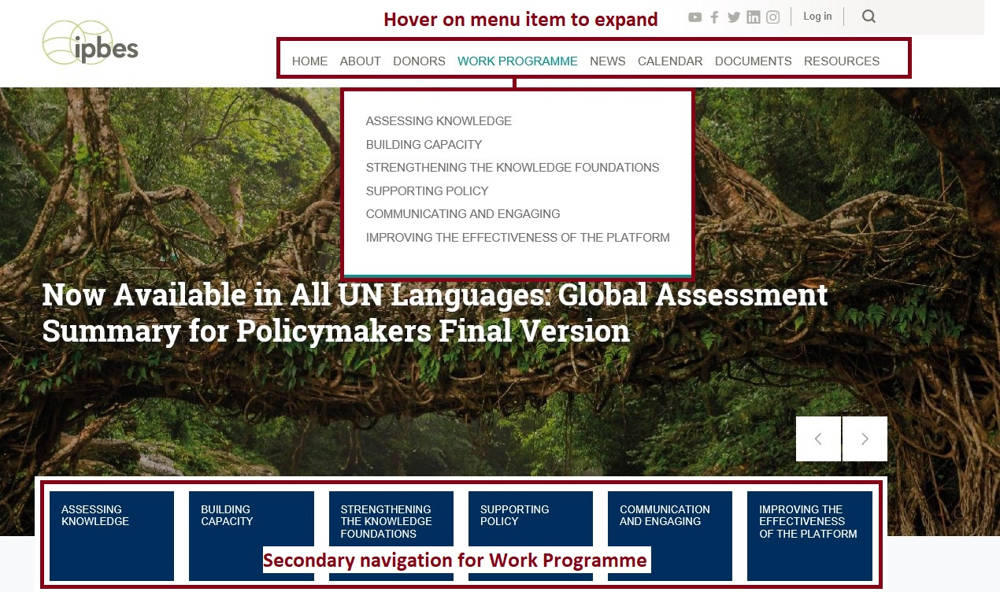
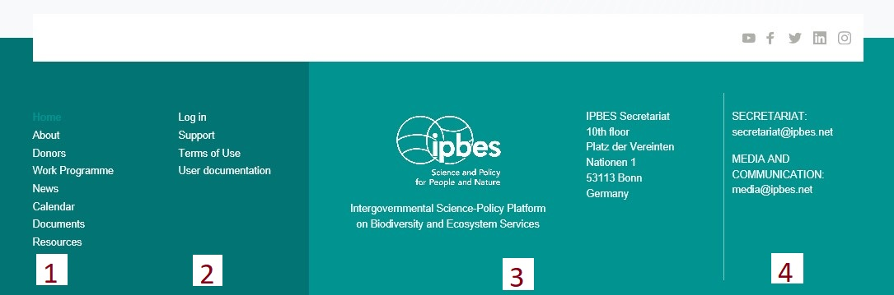

# Navigation on desktop

## Main menu

## Sub-navigation

Within text navigation

## Footer menu

The footer menu contains quick links to the main menu items, account login, user profile and provides contact information.

1. Quick links to menu items
2. Links to log-in/out, create a support ticket, terms of use, and user documentation
3. IPBES logo and address information
4. Email contact information for the general, media and communication issues

