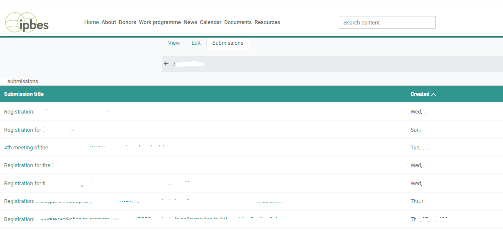

# Forms

## Submitting a new form

1. [Login](https://ipbes.net/user/login) to the website
2. Open the registration link
3. Fill the form and click submit.

## View and edit an existing form.

1. Login to your web [profile](https://ipbes.net/user)
2. Navigate to the forms via the "submissions tab"
3. Select the form to edit
4.

    <figure><figcaption>
view and edit forms
</figcaption></figure>
